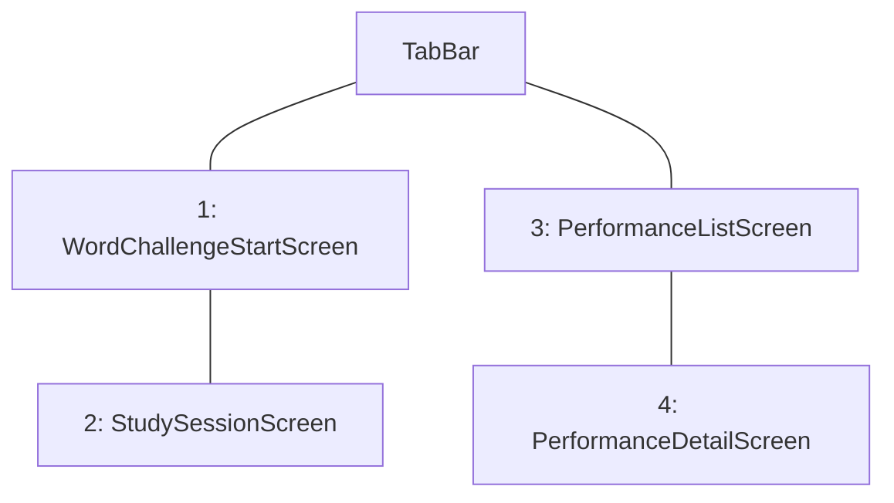

# 画面遷移図

## 画面一覧

| # | 画面名 | 概要 |
| --- | --- | --- |
| 1 | WordChallengeStartScreen | 学年と学習数を指定し、学習または復習を開始する開始画面。 |
| 2 | StudySessionScreen | カード画像を表示し、スワイプ判定と長押し切り替えで学習を進める画面。 |
| 3 | PerformanceListScreen | 学習履歴の概要一覧を表示し、成績詳細へ遷移する画面。 |
| 4 | PerformanceDetailScreen | 選択した学習回の正誤内訳と単語詳細を表示する画面。 |

## ナビゲーションツリー

