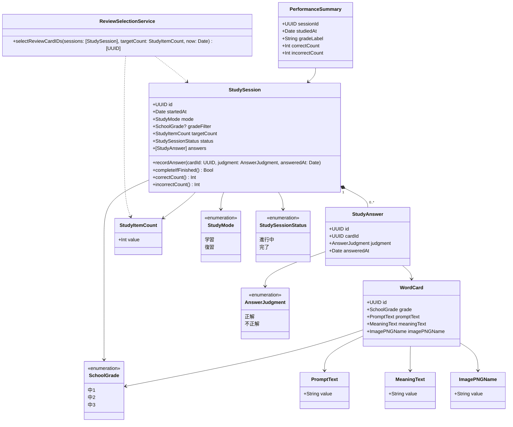

# Domain Model

```mermaid
classDiagram
  class WordCard {
    +UUID id
    +SchoolGrade grade
    +PromptText promptText
    +MeaningText meaningText
    +ImagePNGName imagePNGName
  }

  class StudySession {
    +UUID id
    +Date startedAt
    +StudyMode mode
    +SchoolGrade? gradeFilter
    +StudyItemCount targetCount
    +StudySessionStatus status
    +[StudyAnswer] answers
    +recordAnswer(cardId: UUID, judgment: AnswerJudgment, answeredAt: Date)
    +completeIfFinished() Bool
    +correctCount() Int
    +incorrectCount() Int
  }

  class StudyAnswer {
    +UUID id
    +UUID cardId
    +AnswerJudgment judgment
    +Date answeredAt
  }

  class PerformanceSummary {
    +UUID sessionId
    +Date studiedAt
    +String gradeLabel
    +Int correctCount
    +Int incorrectCount
  }

  class StudyItemCount {
    +Int value
  }

  class PromptText {
    +String value
  }

  class MeaningText {
    +String value
  }

  class ImagePNGName {
    +String value
  }

  class ReviewSelectionService {
    +selectReviewCardIDs(sessions: [StudySession], targetCount: StudyItemCount, now: Date) [UUID]
  }

  class SchoolGrade {
    <<enumeration>>
    中1
    中2
    中3
  }

  class StudyMode {
    <<enumeration>>
    学習
    復習
  }

  class AnswerJudgment {
    <<enumeration>>
    正解
    不正解
  }

  class StudySessionStatus {
    <<enumeration>>
    進行中
    完了
  }

  WordCard --> SchoolGrade
  WordCard --> PromptText
  WordCard --> MeaningText
  WordCard --> ImagePNGName

  StudySession --> StudyMode
  StudySession --> SchoolGrade
  StudySession --> StudyItemCount
  StudySession --> StudySessionStatus
  StudySession "1" *-- "0..*" StudyAnswer

  StudyAnswer --> AnswerJudgment
  StudyAnswer --> WordCard

  PerformanceSummary --> StudySession
  ReviewSelectionService ..> StudySession
  ReviewSelectionService ..> StudyItemCount
```
