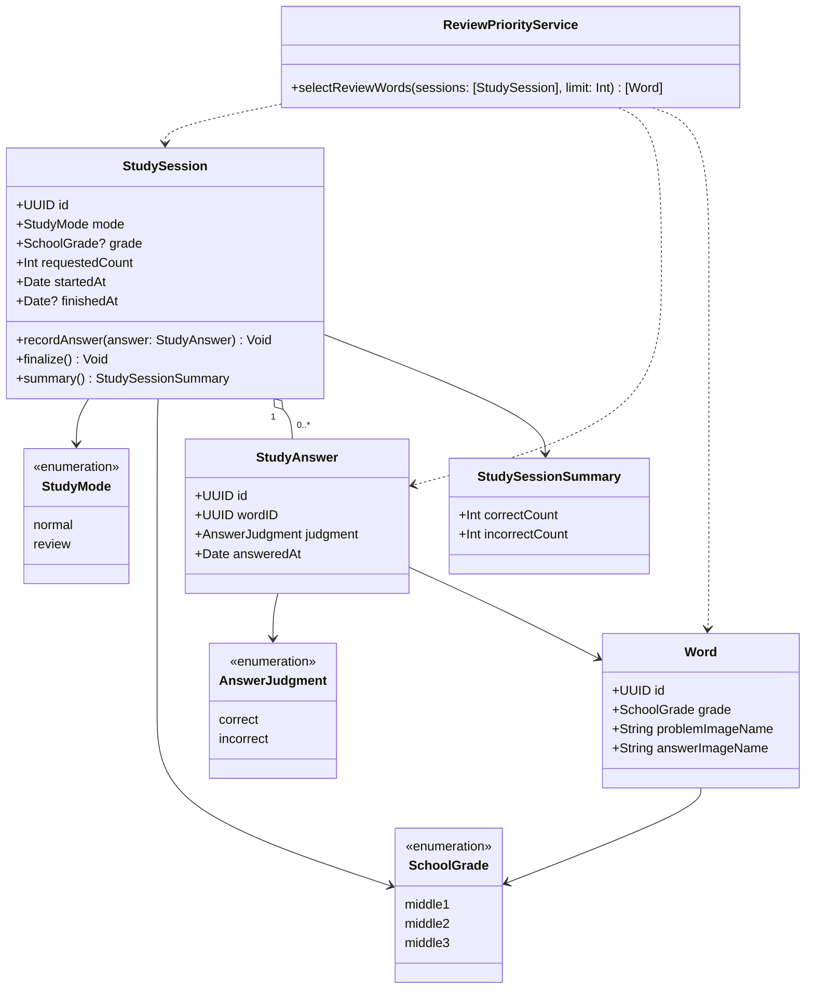

# DomainModel

```mermaid
classDiagram
    class Word {
      +UUID id
      +SchoolGrade grade
      +String problemImageName
      +String answerImageName
    }

    class StudySession {
      +UUID id
      +StudyMode mode
      +SchoolGrade? grade
      +Int requestedCount
      +Date startedAt
      +Date? finishedAt
      +recordAnswer(answer: StudyAnswer) Void
      +finalize() Void
      +summary() StudySessionSummary
    }

    class StudyAnswer {
      +UUID id
      +UUID wordID
      +AnswerJudgment judgment
      +Date answeredAt
    }

    class StudySessionSummary {
      +Int correctCount
      +Int incorrectCount
    }

    class ReviewPriorityService {
      +selectReviewWords(sessions: [StudySession], limit: Int) [Word]
    }

    class SchoolGrade {
      <<enumeration>>
      middle1
      middle2
      middle3
    }

    class StudyMode {
      <<enumeration>>
      normal
      review
    }

    class AnswerJudgment {
      <<enumeration>>
      correct
      incorrect
    }

    Word --> SchoolGrade
    StudySession --> StudyMode
    StudySession --> SchoolGrade
    StudySession "1" o-- "0..*" StudyAnswer
    StudySession --> StudySessionSummary
    StudyAnswer --> AnswerJudgment
    StudyAnswer --> Word
    ReviewPriorityService ..> StudySession
    ReviewPriorityService ..> StudyAnswer
    ReviewPriorityService ..> Word
```
