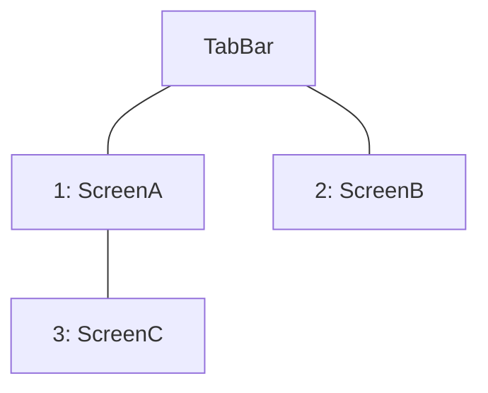

# 画面遷移図

## 画面一覧

| #   | 画面名  | 概要 |
| --- | ------- | ---- |
| 1   | ScreenA | ...  |
| 2   | ScreenB | ...  |
| 3   | ScreenC | ...  |

## ナビゲーションツリー

```mermaid
graph TD
  Root["TabBar"]

  Root --- A["1: ScreenA"]
  Root --- B["2: ScreenB"]

  A --- C["3: ScreenC"]
```
